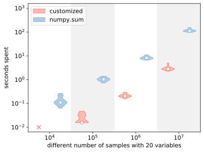
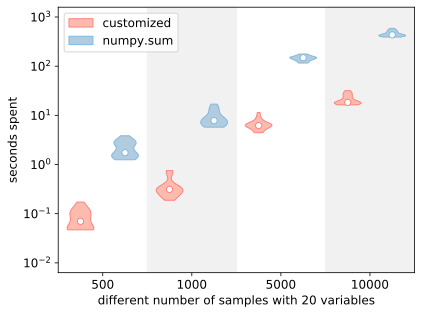

# Faster Hamming Calculator

## Motivation
For calculating Hamming distance, an apparent strategy could be:
```python
from numpy import random, sum

variable_number = 20
sample_1 = random.randint(0, 2, size=(int(variable_number),))
sample_2 = random.randint(0, 2, size=(int(variable_number),))
distance = sum(sample_1 != sample_2)
```

However, in large-scale operations, such as 1,000,000 times, its runtime is difficult to be accepted by users.
Hence, this work is specifically designed for large-scale Hamming distance calculation.
The results shown that the runtime comparison is **our proposed** << **numpy.sum**.

## Methodology
### Comparison of Hamming distance between one sample and all other samples
This function is often used in the task of investigating 
whether an individual belongs to a population.

Here is a case for such task.
Let variable size is $v$ and population size is $p$ and assume that we have three samples as a population:
$A_1 = \left( \begin{array}{c} 1 & 1 & 0 \end{array} \right)_{1 \times v}$, 
$A_2 = \left( \begin{array}{c} 0 & 1 & 1 \end{array} \right)_{1 \times v}$,
and $A_3 = \left( \begin{array}{c} 0 & 1 & 0 \end{array} \right)_{1 \times v}$.
So the sample matrix could be:
$$
M =
\left( \begin{array}{c} 
A_1 \\
A_2 \\
A_3
\end{array} \right)_{p \times v} =
\left( \begin{array}{c} 
1 & 1 & 0 \\
0 & 1 & 1 \\
0 & 1 & 0
\end{array} \right)_{3 \times 3}.
$$
Besides, there is an individual 
$$
A_{1 \times v} = 
\left( \begin{array}{c} 
0 & 1 & 0
\end{array} \right)_{1 \times 3}.
$$
Finally, the distance array would be:
$$
H_{1 \times p} = H_{1 \times 3} = 
\left( \begin{array}{c} 
\sum_{i=1}^3 h(|A_1[i] - A[i]|) & \sum_{i=1}^3 h(|A_2[i] - A[i]|) & \sum_{i=1}^3 h(|A_3[i] - A[i]|)
\end{array} \right)_{1 \times v} =
\left( \begin{array}{c} 
1 & 1 & 0
\end{array} \right)_{1 \times 3}.
$$
where $h(*)$ is the Heaviside step function that
$$
h(v) = \left\{
\begin{array}{cc}
1 & v > 0 \\
0 & v \leq 0
\end{array}
\right.
$$

We found a default subtraction setting in [numpy](https://numpy.org/).
In the two-dimensional matrix subtraction, 
if the column number of the two matrices is the same, 
the row number of the former matrix is greater than 1,
and that of the latter matrix is equal to 1, 
the latter matrix will be automatically expanded and keep consistent with the size of the former matrix.
That is,
$$ M_{p \times v} - A_{1 \times v} 
\Rightarrow M_{p \times v} - 
\left( \begin{array}{c} 
a_1 & a_2 & \cdots & a_v \\ 
a_1 & a_2 & \cdots & a_v \\ 
\vdots & \vdots & \ddots & \vdots \\ 
a_1 & a_2 & \cdots & a_v 
\end{array} \right)_{p \times v} $$
where 
$$A_{1 \times v} =
\left( \begin{array}{c} 
a_1 & a_2 & \cdots & a_v.
\end{array} \right)_{1 \times v}
$$

By this, Hamming distances can be calculated in parallel through the simple matrix operation,
to greatly reduce the runtime, 
which is implemented [here](https://github.com/HaolingZHANG/FasterHammingCalculator/blob/main/calculator.py#L7).

For example, you can use it as:
```python
from numpy import array
from calculator import hamming_group

sample = array([0, 1, 0])
sample_group = array([[1, 1, 0], [0, 1, 1], [0, 1, 0]])
hamming_group(observed_sample=sample, sample_group=sample_group, threshold=None)
# array([1, 1, 0])
```

The comparison with the above two conventional methods is as follows:

<p align="center">

</p>

Here, $\times$ implies that observation and statistics cannot be carried out in the unit of seconds. 

### Comparison of Hamming distance between a group of samples
This function is often used to investigate 
the differences between individuals within a population.

Here is a case for such task.
Let variable size is $v$ and population size is $p$, assume that we have three samples as:
$A_1 = \left( \begin{array}{c} 1 & 1 & 0 \end{array} \right)$, 
$A_2 = \left( \begin{array}{c} 0 & 1 & 1 \end{array} \right)$,
and $A_3 = \left( \begin{array}{c} 0 & 1 & 0 \end{array} \right)$.
The sample matrix could be:
$$
M =
\left( \begin{array}{c} 
A_1 \\
A_2 \\
A_3
\end{array} \right)_{3 \times 3} =
\left( \begin{array}{c} 
1 & 1 & 0 \\
0 & 1 & 1 \\
0 & 1 & 0
\end{array} \right)_{3 \times 3}.
$$
The result would be:
$$
H_{p \times p} =
\left( \begin{array}{c} 
\sum_{i=1}^3 h(|A_1[i] - A_1[i]|) & \sum_{i=1}^3 h(|A_1[i] - A_2[i]|) & \sum_{i=1}^3 h(|A_1[i] - A_3[i]|) \\
\sum_{i=1}^3 h(|A_2[i] - A_1[i]|) & \sum_{i=1}^3 h(|A_2[i] - A_2[i]|) & \sum_{i=1}^3 h(|A_2[i] - A_3[i]|) \\
\sum_{i=1}^3 h(|A_3[i] - A_1[i]|) & \sum_{i=1}^3 h(|A_3[i] - A_2[i]|) & \sum_{i=1}^3 h(|A_3[i] - A_3[i]|)
\end{array} \right)_{p \times p}
=
\left( \begin{array}{c} 
0 & 2 & 1 \\
2 & 0 & 1 \\
1 & 1 & 0
\end{array} \right)_{3 \times 3}.
$$


Inspired from the outer product in [numpy.dot](https://numpy.org/doc/stable/reference/generated/numpy.dot.html), 
we used an additional dimension to save the information of $|v1 - v2|$.
Thus, the customized process is created below:
- Copy the investigated sample matrix $M^i_{p \times v}$ as a backup matrix $M^c_{p \times v}$.
- Expand $M^i_{p \times v}$ and $M^c_{p \times v}$ into a three-dimensional matrix. 
The length of the new dimension is $p^\prime$, and $p^\prime = p$.
These two matrices are therefore turned into $M^i_{p \times p^\prime \times v}$ and $M^c_{p \times p^\prime \times v}$.
- Transpose $M^c_{p \times p^\prime \times v}$ as $M^c_{p^\prime \times p \times v}$ for following calculation.
- Calculate the positive three-dimensional matrix 
$M = |M^i_{p \times p^\prime \times v} - M^c_{p^\prime \times p \times v}|$.
If there is a threshold to judge whether the two values are equal, 
$M$ will be further completed by [numpy.where](https://numpy.org/doc/stable/reference/generated/numpy.where.html) 
function to obtain a three-dimensional bool matrix.
- Complete sum operation of $M$ on the third axis (length $v$), and the shape of $M$ will become 
$(p \times p^\prime) = (p \times p)$.
Such matrix $M_{p \times p}$ is the target Hamming matrix.

The Python code is 
implemented [here](https://github.com/HaolingZHANG/FasterHammingCalculator/blob/main/calculator.py#L50).
For example, you can use it as:
```python
from numpy import array
from calculator import hamming_matrix

samples = array([[1, 1, 0], [0, 1, 1], [0, 1, 0]])
hamming_matrix(samples=samples)
# array([[0, 2, 1],
#        [2, 0, 1],
#        [1, 1, 0]])
```

The comparison with the above two conventional methods is as follows:

<p align="center">

</p> 

### Comparison of Hamming distance between two groups of samples.
This function is usually used to investigate 
the individual differences between two populations.

Here is a case for such task.
Let variable size is $v$ and population size of two populations are $p_1$ and $p_2$.
These two populations could be defined as:
$$
M_1 =
\left( \begin{array}{c} 
A_1 \\
A_2 \\
A_3
\end{array} \right)_{p_1 \times v} =
\left( \begin{array}{c} 
1 & 1 & 0 \\
0 & 1 & 1 \\
0 & 1 & 0
\end{array} \right)_{3 \times 3}
$$
and
$$
M_2 =
\left( \begin{array}{c} 
B_1 \\
B_2
\end{array} \right)_{p_2 \times v} =
\left( \begin{array}{c} 
0 & 0 & 1 \\
1 & 0 & 1
\end{array} \right)_{2 \times 3}.
$$
The result would be:
$$
H_{p \times p} =
\left( \begin{array}{c} 
\sum_{i=1}^3 h(|A_1[i] - B_1[i]|) & \sum_{i=1}^3 h(|A_1[i] - B_2[i]|) \\
\sum_{i=1}^3 h(|A_2[i] - B_1[i]|) & \sum_{i=1}^3 h(|A_2[i] - B_2[i]|) \\
\sum_{i=1}^3 h(|A_3[i] - B_1[i]|) & \sum_{i=1}^3 h(|A_3[i] - B_2[i]|)
\end{array} \right)_{p_1 \times p_2}
=
\left( \begin{array}{c} 
3 & 2 \\
1 & 2 \\
2 & 3
\end{array} \right)_{3 \times 2}.
$$

The process of intra group operation and inter group operation is similar.
The only difference is in the expanding step:
For $M^1_{p_1 \times v}$ and $M^2_{p_2 \times v}$, their expanded three-dimensional matrix could be
$M^1_{p_2 \times p_1 \times v}$ and $M^2_{p_1 \times p_2 \times v}$ respectively.
And $M_{p_1 \times p_2} = M^1_{p_1 \times p_2 \times v} - M^2_{p_1 \times p_2 \times v}$
The shape of final target matrix $M$ is $(p_1, p_2)$.


The Python code is 
implemented [here](https://github.com/HaolingZHANG/FasterHammingCalculator/blob/main/calculator.py#L50).
For example, you can use it as:
```python
from numpy import array
from calculator import hamming_matrix

samples_1 = array([[1, 1, 0], [0, 1, 1], [0, 1, 0]])
samples_2 = array([[0, 0, 1], [1, 0, 1]])
hamming_matrix(samples=samples_1, other_samples=samples_2)
# array([[3, 2],
#        [1, 2],
#        [2, 3]])
```

The comparison with the above two conventional methods of inter group operation 
is similar as that of intra group operation.

## Notes
### Block Calculation and Further Parallelization
Sometimes, the above-mentioned matrix optimization is not enough, 
or the three-dimensional matrix is too large to be allocated.

We recommend to introduce the block calculation, that is,
$M_{p \times v} = M_{g \times p^\prime \times v}$,
where $g$ is group size, $p$ is population size, $p^\prime$ is sub-population size, and $v$ is variable number. 
Obviously, $p^\prime \times g = p$.

Here is a simple example:
```python
from numpy import random

group_number, sub_sample_number, variable_number = 10, 1000, 20
samples = random.randint(0, 2, size=(group_number * sub_sample_number, variable_number))
sample_group = samples.reshape(group_number, sub_sample_number, variable_number)  # segment into 10 groups.
```

If there are 8 cores in available in you laptop, the multi-threading can be tried:
```python
from multiprocessing import Pool
from numpy import random, save
from itertools import product
from calculator import hamming_matrix

def calculate(part_index, samples_1, samples_2):
    sub_matrix = hamming_matrix(samples_1, samples_2)
    save(file=part_index + ".npy", arr=sub_matrix)

pool = Pool(processes=8)
group_number, sub_sample_number, variable_number = 10, 1000, 20
samples = random.randint(0, 2, size=(group_number * sub_sample_number, variable_number))
sample_group = samples.reshape(group_number, sub_sample_number, variable_number)  # segment into 10 groups.
for former, latter in product(range(10), repeat=2):
    pool.apply_async(calculate, args=(str(former) + "." + str(latter), sample_group[former], sample_group[latter]))
pool.close()
pool.join()
```
The code "for former, latter in product(range(10), repeat=2)" implies that 
only the slices of the upper triangular matrix are calculated.

### our proposed method versus numpy.count_nonzero
When variable size is very small (e.g. less than 100), this method is 
almost consistent with 
[numpy.count_nonzero](https://numpy.org/doc/stable/reference/generated/numpy.count_nonzero.html) in runtime.
And the advantage of this numpy function is that it will not open up a lot of memory to calculate.
On the contrary, if the variable size cannot be ignored, we prefer to recommend our proposed method.